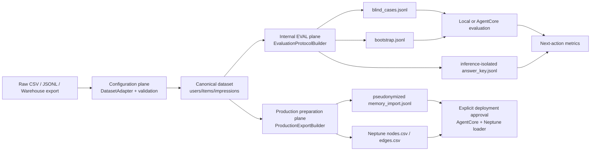
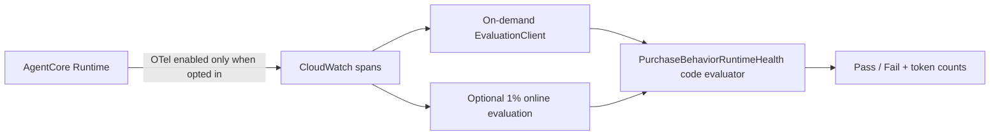

# SimPlayer Purchase 아키텍처

> SimPlayer Purchase는 SimUSER의 persona·memory 기반 사용자 simulation에서 영감을 받은 기술 프로토타입이다. 실제 게임 telemetry로 학습·보정된 production CVR 모델이 아니다.

이 문서는 현재 저장소에 구현된 경로만 설명한다. 별도의 CVR, sequence, ranking 또는 ensemble 모델을 만들거나 학습하는 것을 아키텍처 전제로 요구하지 않는다. 명시적으로 future plan으로 표시한 시간 모델만 현재 범위 밖이다.

## 1. 목표

특정 사용자 `u`, 호출자가 지정한 상품·번들 `i`, 가상 노출 문맥 `c`에 대해 상태별 next action distribution과 가능한 행동 trajectory를 시뮬레이션한다. 공개 응답은 이력·상태·LLM evidence를 결합한 scalar 구매점수와 행동 경로에서 계산한 trajectory 구매확률을 함께 제공한다.

```text
P(purchase | impression, user=u, item=i, context=c)
```

이 프로토타입의 우선순위는 **행동 plausibility, trajectory 재현성, 설명 가능성, 재현 가능한 평가, 운영 가능성**이다. 현재 검증 배포와 공개 평가는 `us-east-1`에서 수행했다.

이 시스템은 추천 후보를 선택하거나 상품을 정렬하는 recommender가 아니다. 새 상품, 기존 상품 또는 번들을 특정 사용자 persona에 노출했다고 가정하는 product response simulator다. SimUSER는 persona와 memory를 가진 사용자 프록시이며 통계적으로 보정된 구매 예측 모델이 아니다. 확률 출력은 사용자의 가능한 행동 경로를 표현하는 simulation signal로 사용하고 실제 CVR 또는 매출 예측으로 해석하지 않는다.

## 2. 기술 스택과 현재 구현 아키텍처

### 2.1 실행 경계와 용어

이 문서에서 **AgentCore Runtime**은 Amazon Bedrock AgentCore Runtime을 뜻한다. AgentCore Runtime은 foundation model 자체를 호스팅하지 않는다. [`agentcore_app.py`](../src/purchase_behavior_simulator/agentcore_app.py)의 Python application을 실행하고, application이 Strands model adapter를 통해 설정된 foundation model을 호출한다.

```text
Caller
  -> Amazon Bedrock AgentCore Runtime
       -> SimPlayer Purchase Python application
            -> configured foundation model
            -> AgentCore Memory
            -> Neptune Serverless
```

- **AgentCore Runtime 실행**: VPC와 AWS IAM authorizer가 적용된 관리형 HTTP serving 경로다.
- **Local 실행**: 같은 `BehaviorSimulationService`를 현재 Python process에서 직접 생성한다. AgentCore Runtime endpoint를 호출하지 않는다.
- **Runtime**: 이후 별도 수식어 없이 Runtime이라고 쓰면 AgentCore Runtime을 의미한다.
- **Foundation model**: AgentCore Runtime 외부에서 호출되는 inference service다. 모델 ID는 ignored deployment config 또는 환경변수로 선택한다.
- **AgentCore Memory와 Neptune**: AgentCore Runtime과 분리된 외부 상태 저장·검색 서비스다.

공개 operation은 `simulate`, `record_observations`, `evaluate_snapshot` 세 가지이며 [`runtime_api.py`](../src/purchase_behavior_simulator/runtime_api.py)가 local 실행과 AgentCore Runtime에서 동일한 routing 계약을 사용한다.

### 2.2 기술 스택과 선택 이유

| 계층 | 기술 | 담당 역할 | 선택 이유와 경계 |
| --- | --- | --- | --- |
| 언어와 domain core | Python 3.14 | 요청 검증, deterministic scoring, action graph, dataset/evaluation 도구 | 로컬과 AgentCore Runtime이 같은 core package를 사용해 동작 차이를 줄인다. |
| Managed serving | Amazon Bedrock AgentCore Runtime | `BedrockAgentCoreApp` entrypoint, HTTP serving, Runtime version, VPC/IAM 경계 | 수십 초가 걸릴 수 있는 agent inference를 관리형 Runtime에서 실행하고 AgentCore Memory·관측 기능과 같은 배포 단위로 관리한다. |
| Agent orchestration | Strands Agents | probability assessment, action actor, self-ask retrieval과 critic의 structured model 호출 | Pydantic structured output과 model adapter를 사용하면서 deterministic transition·scoring은 application code에 남길 수 있다. |
| Foundation model adapter | `OpenAIResponsesModel` 또는 `BedrockModel` | 설정된 model ID에 맞는 inference 호출 | `openai.*` ID는 Bedrock Mantle 경로, 그 외 지원 ID는 Bedrock model adapter를 사용한다. 모델을 Git에 고정하지 않는다. |
| Structured contracts | Pydantic | Strands actor·critic·reflection output schema와 validation | 자유형 텍스트를 그대로 신뢰하지 않고 확률, confidence, state/action 구조를 검증한다. |
| Behavioral memory | Amazon Bedrock AgentCore Memory | short-term event, semantic, summarization, user preference와 episodic record | 관측된 과거 행동을 actor별 namespace로 관리하고 Runtime lifecycle과 분리한다. 예측 결과는 Memory에 다시 쓰지 않는다. |
| Relationship retrieval | Amazon Neptune Serverless | 사용자·상품·category·character·event·bundle 관계와 PathSim evidence | multi-hop 관계 evidence를 graph로 조회하며, endpoint가 없을 때도 simulator core는 동작한다. |
| AWS integration | Boto3 | AgentCore Memory, Neptune Data API와 배포 보조 API 호출 | AWS SDK 계약과 IAM credential chain을 그대로 사용한다. |
| Infrastructure | AgentCore CDK + AWS CDK, TypeScript | Runtime, Memory, evaluator, VPC 설정과 IAM 배포 | 리소스 선언과 재배포 절차를 코드로 고정하고 환경별 물리 ID는 local config에서 주입한다. |
| Observability | CloudWatch/OpenTelemetry + code evaluator | Runtime error, 5xx와 fallback span 검사 | 기본 serving에서는 비활성이고 필요할 때만 managed evaluation을 opt-in한다. |
| Evaluation | Python checkpoint harness + JSONL | 1건 smoke, 현재 200건 탐색 평가, resume와 fallback retry | answer key를 inference와 분리하고 장시간 실행을 case 단위 checkpoint로 복구한다. |

### 2.3 요청 실행 구조

```mermaid
flowchart LR
    Client["Caller / Evaluation Client"] --> Runtime["Amazon Bedrock AgentCore Runtime\nPython application / us-east-1"]
    Runtime --> Memory["AgentCore Memory\nShort-term events + long-term episodes/reflections"]
    Runtime --> Neptune["Neptune writer endpoint\nread + write"]
    Runtime --> Assessment["Configured model\nprobability assessment"]
    Runtime --> Actor["Same configured model\naction actor"]
    Actor --> Grounding["Observed-transition grounding"]
    Grounding --> Commitment["Selection-to-commitment gate\nBUY / EXPLORE / DEFER / REJECT"]
    Commitment --> Critic["Fresh-context critic\nbounded hard-constraint revision"]
    Critic --> Counterfactual["Price / need / urgency / ownership\ncounterfactual validation"]
    Neptune --> KG["Top-K PathSim behavior evidence"]
    KG --> Assessment
    KG --> Actor
    Assessment --> Fusion["Deterministic log-odds fusion"]
    Critic --> Fusion
    Base["Deterministic behavioral prior"] --> Fusion
    Fusion --> Result["Action distributions + trajectory + evidence"]

    Observer["External observation/import"] --> Validator["Observation source validation"]
    Validator --> Memory
    Generator["Generation session\nscenario + inference-isolated oracle"] --> Labeler["Independent labeling session"]
    Labeler --> S3["S3 bulk-load files"]
    S3 --> Writer["Neptune Serverless Writer Endpoint"]
    Writer --> Neptune
```



AgentCore Gateway는 사용하지 않는다. AgentCore Runtime의 Python application이 VPC 내부에서 Neptune Data API를 호출하고, Strands model adapter로 설정된 foundation model을 호출한다. 배포 모델은 Git에 고정하지 않고 ignored local deployment config에서 선택한다. Git의 compact report는 state-rich long-path natural protocol의 graph v3 200건 prefix를 완료한 결과이며, 다른 모델을 사용하면 같은 수치를 기대할 수 없다.

### 2.4 Dataset lifecycle plane

외부 데이터 연결은 serving path와 분리된 세 plane으로 구성한다.



`answer_key.jsonl`은 EVAL report 계산에만 연결되며 Production preparation이나 serving Runtime으로 향하는 edge가 없다.

### 2.5 Plane별 책임

| Plane | 입력 | 출력 | 허용되는 민감 정보 | 외부 변경 |
| --- | --- | --- | --- | --- |
| Configuration | 원본 export와 mapping config | canonical dataset와 validation manifest | 원본이 가진 범위, 배포 전 비식별 권장 | 없음 |
| Internal EVAL | canonical dataset | bootstrap, blind case, inference-isolated answer key | 평가용 user ID와 실제 future action | 없음 |
| Production preparation | canonical dataset와 `as-of` | 가명화 Memory/KG import | HMAC user/session ID, 과거 관측 | 없음 |
| Production deployment | 검토된 production bundle | AgentCore Memory, Neptune, Runtime | production 정책에 승인된 필드만 | AWS 변경 |

Configuration은 AWS SDK나 LLM을 호출하지 않는다. Internal EVAL 준비 역시 모델을 호출하지 않으며, 모델 호출은 blind case 실행 단계에서만 발생한다. Production preparation은 artifact만 만들고 배포하지 않는다.

### 2.6 코드 경계

```text
DatasetAdapter
  -> CanonicalDataset
       -> EvaluationProtocolBuilder
            -> HoldoutProtocol
            -> save_protocol()
       -> ProductionExportBuilder
            -> memory_import.jsonl
            -> Neptune bulk-load CSV
```

- `DatasetAdapter`: source-specific parsing과 column/action mapping
- `CanonicalDataset`: source와 무관한 user/item/impression 계약과 referential validation
- `EvaluationProtocolBuilder`: temporal split, evaluation actor ID, inference-isolated labels
- `ProductionExportBuilder`: as-of filter, HMAC identity, label-free import artifacts
- AgentCore/CDK: 검토된 production artifact를 실제 리소스에 반영하는 별도 경계

`DatasetAdapter`가 answer key를 만들거나 Production builder가 evaluation split을 읽는 구조를 금지한다.

### 2.7 Canonical schema

Canonical user:

```text
user_id
persona_summary
pickiness
price_sensitivity
category_preferences
engagement
variety
budget_reference
attributes
```

Canonical item:

```text
item_id
product_type: item | bundle
categories
price
discount_rate
components:
  item_id
  quantity
need_profile:
  rational
  emotional
  rational_aspects
  emotional_aspects
  source
attributes:
  character
  event_id
  quality
  utility
  ...
```

`product_type=bundle`이면 하나 이상의 component가 필요하며 모든 component ID는 같은 catalog에 존재해야 한다. 현재 canonical schema는 bundle 구성 관계를 first-class metadata로 보존하고 Production graph export에서 `CONTAINS` edge로 변환한다.

#### Product specification과 scenario override

불변에 가까운 catalog product와 한 번의 실험에만 적용할 값을 분리한다.

```text
Catalog product
  product_id
  product_type
  categories
  price
  discount_rate
  components
  attributes

Product scenario
  price_override
  discount_rate_override
  add_categories
  remove_categories
  attribute_overrides

Exposure scenario
  surface
  session_fatigue
  budget_reference
  timestamp
```

요청 parser는 새 `target_product/product_scenario/exposure_scenario` 계약을 resolve한 뒤 기존 내부 `Item/ExposureContext` 모델로 변환한다. 기존 `item/context` payload는 하위 호환으로 유지한다.

Scenario override는 catalog, Memory, Neptune의 과거 사실을 수정하지 않는다. 현재 요청에 사용할 resolved target product만 만든다. 예를 들어 가격 변경은 현재 affordability와 `price/budget` 계산에만 영향을 주고 과거 transaction 가격을 재작성하지 않는다.

#### Need-disentangled product response

SimPlayer Purchase는 상품에 대한 기능적 필요와 감정적 선호를 별도 evidence lane으로 정리한다. 이는 학습된 latent model이 아니라 retrieval과 prompt에 전달되는 명시적 추론 계약이다.

```text
resolved target product
  -> ProductNeedProfile
       -> rational evidence lane
            recent functional satisfaction
            time since similar utility
            progression/campaign context
            redundancy and price efficiency
       -> emotional evidence lane
            stable aesthetic/identity preference
            collection, enjoyment, social expression
            longer-history consistency
  -> shared Sol actor
  -> conditional action distributions
```

`ProductNeedProfile`은 explicit catalog metadata를 우선한다. 없으면 category, `functional_tags`, `style_tags`, `utility_type`, `style`을 smoothing된 heuristic으로 해석한다. signal이 없으면 `mixed`로 유지한다. 이 profile은 구매 logit에 직접 더하지 않고 retrieval/prompt routing과 evaluation slicing에만 사용한다.

상품과 번들에 별도 actor를 두지 않는다. Bundle은 구성 상품별 기능적 상호보완, 보유 중복, 가격 효율과 테마·스타일 일관성을 함께 평가한다. 즉 `product_type`은 동기 분류가 아니라 구성 해석 방식만 바꾼다.

Canonical impression:

```text
impression_id
user_id
item_id
timestamp
session_id
surface
clicked
purchased
click_timestamp
purchase_timestamp
session_fatigue
budget_reference
context_features
observed_initial_state       # optional explicit label
observed_next_action         # optional explicit label
observed_detail_action       # optional explicit label
oracle_probability           # optional synthetic diagnostic only
```

실제 데이터에는 `oracle_probability`가 없어야 정상이다. 이 필드는 synthetic generator 회귀 진단과 과거 protocol 호환을 위해 optional로만 유지한다.

### 2.8 Source mapping modes

`MappedTabularDatasetAdapter`는 두 입력 모델을 제공한다.

#### impression_rows

한 row가 노출과 그 결과를 모두 표현한다.

```text
impression_id, user_id, item_id, timestamp, clicked, purchased
```

#### event_rows

여러 event를 `impression_id`로 묶는다.

```text
IMPRESSION -> CLICK -> START_PURCHASE -> CONFIRM_PURCHASE -> PAYMENT_SUCCESS
IMPRESSION
IMPRESSION -> CLICK -> BACK
IMPRESSION -> CLICK -> START_PURCHASE -> CONFIRM_PURCHASE
           -> INSUFFICIENT_CURRENCY -> OPEN_TOP_UP
           -> TOP_UP_SUCCESS -> CONFIRM_PURCHASE -> PAYMENT_SUCCESS
```

원본 action name은 config의 `action_map`으로 canonical action에 대응시킨다. 동일 impression 안에서 user/item이 바뀌면 validation error다. `IMPRESSION`이 없으면 `SKIP`과 자연 노출 모수를 관측할 수 없으므로 기본적으로 거부한다.

### 2.9 Validation invariants

Configuration 완료 조건:

1. user/item/impression ID가 비어 있지 않고 각 namespace에서 유일하다.
2. 모든 impression의 user와 item이 master record에 존재한다.
3. timestamp가 존재하고 UTC로 정규화 가능하다.
4. event-row는 impression 단위로 완전히 결합 가능하다.
5. action이 선택한 action graph의 허용 transition에 매핑된다.
6. cart action은 거부된다.
7. explicit state/action label이 state machine의 허용 전이와 일치한다.
8. full-funnel 평가라면 `complete_exposure=true`다.

Validation manifest에는 user/item/impression 수, click/purchase 수, state별 action 분포와 exposure completeness를 기록한다.

### 2.10 Internal EVAL leakage boundary

각 사용자의 impression을 timestamp로 정렬하고 하나의 cutoff 뒤에서 평가 case를 선택한다.

```text
t <= cutoff
  -> persona fallback 계산
  -> AgentCore bootstrap events
  -> initial AgentCore Memory / offline PathSim KG snapshot

t > cutoff
  -> blind request
  -> current case 직전까지 실제로 관측된 최대 16 transition
  -> observed next-action answer key
```

평가는 rolling-observation protocol이다. Holdout case A가 case B보다 시간상 앞서면 A의 실제 관측 transition은 B의 optional request history에 포함될 수 있다. 단, B 자체와 B 이후의 행동은 절대 입력에 포함하지 않는다. AgentCore bootstrap snapshot은 cutoff 이전으로 고정하며, request의 recent history가 index 지연 없이 최신 관측을 보완한다.

`blind_cases.jsonl`에는 label, oracle, future action이 없어야 한다. `answer_key.jsonl`은 evaluator process가 모델 호출이 종료된 뒤 case ID로 join한다.

### 2.11 Production export boundary

Production export에는 반드시 `as-of` timestamp와 HMAC salt가 필요하다.

```text
canonical impressions
  -> timestamp <= as-of
  -> HMAC-SHA256(user_id, session_id)
  -> full state/action/next-state record_observations payload
  -> action별 Neptune user-item interaction edge
```

Production manifest는 다음을 명시한다.

```json
{
  "contains_answer_key": false,
  "contains_oracle_probability": false,
  "contains_model_predictions": false,
  "identity_policy": "hmac-sha256"
}
```

Production export는 synthetic source를 기본 거부한다. `--allow-synthetic`은 로컬 fixture smoke 전용이다. HMAC salt는 config나 git에 저장하지 않고 환경 변수 또는 Secrets Manager에서 주입한다.

### 2.12 실데이터 배포 경계

Artifact preparation과 배포는 같은 명령으로 묶지 않는다.

1. Production manifest, Memory payload와 Neptune CSV를 `--dry-run`으로 검증
2. AgentCore/CDK read-only validation
3. 명시적 승인 후 AgentCore Runtime, Memory와 Neptune 배포
4. Runtime `READY`와 dummy smoke 확인
5. artifact fingerprint별 S3 prefix에 Neptune CSV upload
6. Neptune bulk loader 완료 확인
7. `record_observations`로 Memory batch import
8. imported actor를 새 session에서 호출해 long-term Memory와 Neptune evidence를 확인하는 model-backed canary

원격 데이터 초기화는 `scripts/bootstrap_production_data.py --confirm-write`가 5~8단계를 수행한다. Neptune load ID와 완료된 Memory batch ID는 artifact별 checkpoint에 저장하므로 같은 명령을 재실행하면 완료 단계를 건너뛴다. Artifact lineage는 snapshot의 `as_of`와 incremental artifact의 `since`가 연속되는지 검사한다. 별도 `--confirm-write` 없이는 AWS data plane을 변경하지 않는다.

평가 answer key, raw user ID, model prediction, counterfactual trace가 이 경계를 통과하면 배포를 중단한다.

## 3. 현재 추론과 점수 구성

### 3.1 공개 구매점수

SimPlayer Purchase는 프로토타입 단계에서 하나의 구매점수를 정답으로 고정하지 않는다.

- `scalar_purchase_probability`: 과거 관측 행동, 현재 문맥, Memory/KG evidence와 probability assessment를 deterministic log-odds fusion으로 결합한 점수
- `trajectory_purchase_probability`: action graph의 모든 구매 도달 경로 확률을 합산한 값

두 값은 같은 요청에서 함께 반환하며 [평가 문서](evaluation.md)에서 생성된 관측 행동과 각각 비교한다. 둘 다 실제 CVR로 calibration됐다고 주장하지 않는다.

### 3.2 결합식

```text
z = logit(p_base)
    + w_episode × confidence_episode × logit(p_episode)
    + w_context × confidence_context × logit(p_context)
    + w_agent × confidence_agent × logit(p_agent)
    + w_rollout × confidence_rollout
      × (logit(p_rollout) - logit(p_base))

p_fused = sigmoid(z)
p_blended = 0.65 × p_fused + 0.35 × p_rollout  # rollout이 있을 때
# rollout이 없으면 p_blended = p_fused
p_shrunk = sigmoid(
    logit(0.12) + 0.5 × (logit(p_blended) - logit(0.12))
)
p_scalar = optional_platt(p_shrunk)
```

`p_base`는 호출자가 별도 값을 주지 않으면 관측 이력의 smoothed purchase rate를 사용한다. 현재 기본값은 `w_agent=0.5`, `w_rollout=0.1`, rollout output blend `0.35`, shrink `0.5`, anchor `0.12`다. `w_kg` 기본값은 `0`이며 KG는 top-K 행동 evidence로 assessment와 actor에 제공된다.

Platt calibration hook은 외부에서 slope, intercept와 version을 명시한 경우에만 적용한다. 기본 설정은 identity transform이며 응답의 `is_calibrated`는 `false`다.

### 3.3 현재 Runtime 추론 경로

```text
request validation
  -> self-ask query planning
  -> episodic memory + purchase/non-purchase contrastive retrieval
  -> Neptune top-K PathSim behavior retrieval
  -> current game-state interpretation
  -> in parallel:
       probability assessment
       counterfactual action actor
  -> deterministic transition grounding
  -> selection-to-commitment gate
     -> need, selection, feasibility, urgency, uncertainty, hesitation
     -> latent BUY_NOW / EXPLORE / DEFER / REJECT intentions
  -> fresh-context structured critic
     -> persona/recent-behavior checks are advisory
     -> repeat/price-budget hard checks may revise once, TV <= 0.10
  -> deterministic counterfactual validation
     -> higher price, resolved need, removed urgency, ownership constraint
     -> adverse state changes must not increase purchase probability
  -> depth-2 purchase-path probability summation
  -> static probability logit fusion + rollout residual
  -> fixed monotonic logit shrink
  -> response + ephemeral structured trace
```

`HybridAssessmentProvider`는 probability assessment의 likelihood, relative preference, confidence와 reasons를 보존한다. action actor에서는 rollout probability, state별 action distribution, grounding strength와 별도 rollout confidence만 가져온다. 따라서 action-only rollout이 기존 비교 순위 신호를 대체하지 않는다.

### 3.4 선호와 구매 실행의 분리

Persona는 장기 성향을 설명하고 `GameStateSnapshot`은 현재 재화, progression need, 최근 실패, 보유 중복, 이벤트 긴급성, 구매 cooldown과 현재 목표를 표현한다. Decision process는 이를 과거 관측 행동과 결합해 다음 상태를 만든다.

| 상태 | 질문 |
| --- | --- |
| `need_strength` | 이 상품이 현재 목표나 문제를 해결하는가 |
| `selection_strength` | 사용자가 이 상품 자체를 원하는가 |
| `feasibility` | 가격, 재화, 보유 상태와 cooldown을 고려해 지금 구매 가능한가 |
| `urgency` | 지금 행동하지 않으면 손실되는 이유가 있는가 |
| `uncertainty` | 현재 판단을 뒷받침하는 관측 evidence가 얼마나 부족한가 |
| `hesitation` | 선호가 있더라도 구매 실행을 미루게 하는 압력이 얼마나 큰가 |

Actor는 `BUY_NOW`, `EXPLORE`, `DEFER`, `REJECT` 네 의도를 비교한다. `DEFER`는 공개 action이 아니라 commitment를 설명하는 내부 상태다. 노출 상태에서는 `SKIP`, 상세 상태에서는 `BACK`, 구매 확인 상태에서는 `CANCEL`로 매핑한다. `BUY_NOW` 의도는 클릭·구매 시작·구매 확정 단계까지 전달된다. Decision process는 LLM 분포를 무제한 덮어쓰지 않고 상태별 total variation `0.08` 이내에서만 조정한다.

Counterfactual validator는 현재 요청의 가상 사본을 Memory에 쓰거나 모델을 다시 학습하지 않는다. 가격 상승, 필요 해소, 긴급성 제거, 비반복 상품의 보유 제약이 구매확률을 올리지 않는지 요청 trace에서만 검사한다.

Action graph는 게임 안에서 관측되는 화면·이벤트 상태와 사용자 action 전이를 선언한다. 기본 graph는 다음과 같다.

```text
ITEM_EXPOSURE
  CLICK -> ITEM_DETAIL
  PURCHASE_NOW -> PURCHASE_CONFIRMATION
  SKIP | EXIT -> EXITED

ITEM_DETAIL
  START_PURCHASE -> PURCHASE_CONFIRMATION
  BACK -> ITEM_EXPOSURE

PURCHASE_CONFIRMATION
  CONFIRM_PURCHASE -> PAYMENT_PROCESSING
  CANCEL -> ITEM_DETAIL

PAYMENT_PROCESSING
  PAYMENT_SUCCESS -> PURCHASED
  PAYMENT_FAILED -> PURCHASE_CONFIRMATION
  INSUFFICIENT_CURRENCY -> CURRENCY_SHORTFALL

CURRENCY_SHORTFALL
  OPEN_TOP_UP -> CURRENCY_TOP_UP
  BACK_TO_ITEM -> ITEM_DETAIL
  EXIT -> EXITED

CURRENCY_TOP_UP
  TOP_UP_SUCCESS -> PURCHASE_CONFIRMATION
  CANCEL_TOP_UP -> CURRENCY_SHORTFALL
  EXIT -> EXITED
```

게임 상품에는 장바구니 action이 없다고 가정한다. `COMPARISON`이나 `HESITATE`처럼 telemetry에서 직접 확인할 수 없는 행동도 graph에 넣지 않는다. 기본 UX에서 상세와 구매 확인 화면을 떠나는 행동은 각각 `BACK`, `CANCEL`로 기록하고 store surface 전체 이탈은 노출·잔액·충전 상태의 `EXIT`로 기록한다. 모델은 action 확률과 사용자 반응만 추론하며 화면, purchase 종료 여부와 허용되지 않은 전이는 코드가 결정한다. 반복 전이는 허용하지만 trajectory 열거는 `max_depth=10`으로 제한한다.

이 전이는 Runtime에 분산해서 하드코딩하지 않는다. [`src/purchase_behavior_simulator/action_graphs/game-store-purchase.json`](../src/purchase_behavior_simulator/action_graphs/game-store-purchase.json)의 `transitions`, `terminal_outcomes`, `surface_initial_states`를 actor schema, 확률 정규화와 rollout engine이 함께 사용한다. 새 화면이나 이벤트는 [Action graph 문서](action-graphs.md)의 계약에 따라 추가한다. `action_graphs/`의 JSON은 wheel과 AgentCore CodeZip에 포함된다.

### Future plan: 시간 모델

현재 프로토타입은 행동 순서와 terminal outcome만 시뮬레이션한다. 체류시간, 다음 행동까지의 지연과 timeout은 학습하거나 추정하지 않으며 trajectory의 `expected_duration_seconds`는 `null`이다. 향후 실제 telemetry가 확보되면 action probability와 분리된 transition timing model을 연결한다. Action graph에는 이 확장을 위한 optional timing metadata 자리만 유지한다.

공개 `SimulationResult`는 다음을 직접 반환한다.

- `scalar_purchase_probability`
- `trajectory_purchase_probability`
- state별 `action_distributions`
- 확률 상위 5개의 `likely_trajectories`
- `action_graph_id`, `action_graph_version`
- `decision_state`, `intention_distribution`

기존 `probability`는 `scalar_purchase_probability`의 호환 alias다.

## 4. Neptune Serverless 그래프

### 4.1 노드와 관계

```text
(:User)-[:VIEWED|CLICKED|STARTED_PURCHASE|CONFIRMED_PURCHASE
        |PAYMENT_SUCCEEDED|PAYMENT_FAILED|INSUFFICIENT_CURRENCY
        |OPENED_TOP_UP|TOPPED_UP|CANCELLED|BACKED|EXITED|SKIPPED]->(:Item)
(:User)-[:PLAYS]->(:Character)
(:Item)-[:IN_CATEGORY]->(:Category)
(:Item)-[:TARGETS]->(:Character)
(:Item)-[:AVAILABLE_IN]->(:Event)
(:Item)-[:CONTAINS]->(:Item)
```

행동 edge에는 `timestamp`, `sessionId`, `state`, `nextState`, `weight`, `synthetic`을 저장한다. Production export는 관측 경로의 모든 transition을 Memory payload와 Neptune edge에 같은 순서로 보존한다.

### 4.2 Multi-meta-path retrieval

각 과거 상품 `h`와 평가 대상 상품 `i`에 대해 relation별 PathSim을 계산한다.

```text
PathSim_r(h, i)
= 2 × |neighbors_r(h) ∩ neighbors_r(i)|
  / (|neighbors_r(h)| + |neighbors_r(i)|)
```

| 관계           | 의미                                   | 초기 가중치 |
| -------------- | -------------------------------------- | ----------: |
| `IN_CATEGORY`  | 같은 상품 목적                         |        0.35 |
| `TARGETS`      | 같은 캐릭터·클래스                     |        0.30 |
| `AVAILABLE_IN` | 같은 이벤트·시즌                       |        0.20 |
| `CONTAINS`     | 번들 구성·component membership overlap |        0.15 |

최근 행동과 강한 행동에 더 큰 retrieval 가중치를 준다.

```text
event_weight = behavior_weight
               × exp(-ln(2) × age_days / half_life)
```

Neptune provider는 최근 행동 상품의 이웃과 target product 이웃을 parameterized openCypher로 조회한 뒤 애플리케이션에서 relation별 PathSim을 계산한다.

새 상품이 아직 Neptune catalog에 적재되지 않았더라도 요청의 category, character, event, component를 target neighbor로 합성한다. Persistent catalog의 상품은 `ProductionExportBuilder`가 `Item` node와 관계 edge로 내보낸다.

`CONTAINS` 비교는 component membership closure를 사용한다.

```text
target bundle contains A
past interaction item is A
→ component A를 공유하는 관련 evidence

target item is A
past interaction bundle contains A
→ component A를 공유하는 관련 evidence
```

따라서 신규 bundle 자체의 interaction이 없어도 구성 상품에 대한 사용자의 기존 노출·상세·구매 시작·결제 결과 행동을 검색할 수 있다.

SimUSER 논문은 별도의 KG confidence 확률을 정의하거나 이를 구매 logit에 직접 곱하지 않는다. 관련 item과 사용자 interaction, KG path를 검색해 LLM Brain의 근거로 제공한다. 현재 구현도 같은 경계를 따른다.

```text
retrieval_weight(h)
= |behavior_weight(h)| × recency(h) × weighted_PathSim(h, target)
```

상위 5개 evidence만 사용하며 각 문서에는 source item, 실제 interaction, timestamp, relation별 PathSim, 공유 neighbor를 넣는다. 진단용 retrieval quality는 다음 요소만 사용한다.

```text
support     = mean(top-K retrieval_weight)
coverage    = covered target relation weight / available relation weight
diversity   = unique source items / K
consistency = |2 × affinity - 1|

quality = support
          × (0.5 + 0.5 × coverage)
          × (0.5 + 0.5 × diversity)
          × (0.5 + 0.5 × consistency)
```

이 값은 구매확률이나 통계적으로 calibration된 confidence가 아니다. 검색 evidence의 충분성을 관찰하는 diagnostic이며 final logit에 직접 사용하지 않는다. 관련 없는 history는 support와 quality를 올리지 않는다.

### 4.3 성능 설정

- PoC minimum capacity는 지원되는 최솟값인 1 NCU로 둔다.
- 기본 배포는 writer 한 대만 사용하며 읽기도 writer endpoint로 처리한다.
- `MaxCapacity=16`은 비용 상한이면서 bulk load/쓰기 burst의 자동 확장 여유다.
- 현재 배포는 별도 reader 없이 writer endpoint를 조회에도 사용한다.
- synthetic 초기 적재는 S3 bulk loader를 사용한다.
- hot query는 parameterized openCypher와 고정된 history limit을 사용한다.
- user/item ID와 timestamp를 기준으로 query cardinality를 제한한다.

## 5. Synthetic data 원칙

LLM이 구매 label을 생성하지 않는다. Generation session은 label과 구매확률이 없는 사용자·상품·외생 scenario를 만들고, 별도의 labeling session이 사용자별 동적 게임 상태를 시간순으로 유지하며 inference-isolated oracle에서 행동을 sampling한다.

### 5.1 생성되는 잠재 변수

- 사용자: latent preference, lifecycle, spending scale, price/discount sensitivity
- 사용자: pickiness, engagement, novelty, social conformity, impulsivity와 초기 state 조건
- 상품: latent representation, category, character, event, price, quality
- 상품: utility, emotionality, discount, freshness, popularity
- 외생 문맥: surface, progression need, recent failure, active character, session fatigue와 event urgency
- 동적 상태: currency balance, owned item, inventory overlap, last purchase와 purchase cooldown

### 5.2 행동 생성

```text
state before exposure
  = advance(previous state, elapsed time, previously generated purchases)

P(click)
  = synthetic_click_rule(user, item, surface, goals, novelty, fatigue)

P(purchase | click, state)
  = synthetic_purchase_rule(
      affinity, balance/price, need, failure,
      inventory, urgency, cooldown, history
    )

sample action
  -> deduct balance
  -> add non-repeatable item to inventory
  -> start cooldown
  -> carry state to the next exposure
```

Generation 산출물의 `scenarios.jsonl`에는 label과 구매확률을 넣지 않는다. `oracle/oracle.jsonl`에는 oracle version과 protected latent shock만 기록한다. Labeling 산출물에는 노출 직전 `GameStateSnapshot`, synthetic oracle probability, 생성된 action과 causal component를 결합한다.

Generation과 labeling은 서로 다른 session ID와 출력 디렉터리를 사용한다. Labeler는 generation manifest의 파일 hash를 확인하고, 같은 session ID 또는 변조된 입력을 거부한다. 평가 대상 model의 prediction은 oracle과 labeler 입력에 포함되지 않는다.

`synthetic_click_rule`과 `synthetic_purchase_rule`은 학습 모델이 아니라 코드에 명시된 데이터 생성 규칙이다.

### 5.3 생성 가정

Synthetic dataset은 게임 구매 로그를 대체한다고 주장하지 않는다. 할인 빈도, 세션 길이, 초기 inventory, 재화 충전과 구매 cooldown은 `SyntheticAssumptions`에 명시한 가정으로 생성한다. 이 값은 외부 쇼핑 데이터를 게임 행동으로 전이한 수치가 아니며, 실제 게임 telemetry를 사용할 수 있게 되면 해당 게임의 비식별 집계로 교체해야 한다.

가정값은 generation manifest에 기록하므로 같은 seed와 설정으로 데이터셋을 재현하고, 어떤 값이 결과에 영향을 줬는지 추적할 수 있다.

### 5.4 평가 전 gate

- 8개 핵심 `GameStateSnapshot` field coverage 100%
- 수치형 state variation과 inventory/goals 변화
- 가격, balance, need, urgency, ownership와 cooldown의 oracle counterfactual 방향성
- 50→200→500 nested prefix의 사용자·구매율 유지
- blind request와 answer key 분리
- temporal history/holdout split과 file SHA-256

상세 생성 규칙은 `synthetic-data.md`에 설명한다.

## 6. Agent framework와 SimUSER 적용

Agent framework는 Strands Agents를 선택했다.

- AgentCore Runtime과 공식 통합 경로가 짧다.
- Pydantic structured output으로 likelihood/confidence schema를 강제한다.
- 현재 판단 흐름은 장기 상태 그래프보다 한 번의 evidence-balanced assessment에 가깝다.
- 요청마다 Agent를 새로 만들어 사용자 간 state leakage를 방지한다.

| 논문 요소 | PoC 구현 |
| --- | --- |
| Persona | synthetic 사용자 속성 또는 입력 profile을 자연어 summary로 표현 |
| Episodic memory | 외부 관측 event, 장기 observation/reflection record, self-ask hybrid retrieval |
| KG memory | Neptune multi-meta-path affinity |
| Perception | 가격·할인·상품 특성과 현재 게임 상태 해석 |
| Preference elicitation | 검색 문서 3개씩 최대 3라운드 검토 후 충분성 판단 |
| Causal refinement | contradiction/counterfactual 검사와 reflection의 대안 원인 기록 |
| Reflection | 관측 사실로 결정론적으로 생성해 별도 reflection namespace에 기록 |
| Deterministic action transition | 명시적 상태·행동과 코드로 강제한 transition |
| Observed-transition grounding | 유사 surface/category/가격/fatigue의 실제 관측 transition |

Synthetic flow의 persona summary는 생성된 사용자 속성을 설명하지만 구매 label은 결정하지 않는다. 실제 데이터 연결에서는 호출자가 제공하거나 과거 관측에서 구성한 summary를 사용하며 이를 ground truth로 취급하지 않는다. 모델의 예측 결과 자체는 AgentCore Memory에 재기록하지 않으므로 이전 예측이 다음 예측의 positive evidence로 순환하는 self-confirmation 경로를 차단한다.

### 6.1 Episodic memory 실행 계약

기억 쓰기와 예측은 서로 다른 Runtime operation이다.

```text
record_observations
  -> source allow-list validation
  -> deterministic reflection from observed facts only
  -> AgentCore short-term event
  -> long-term observation record: /episodes/{actorId}/{sessionId}
  -> long-term reflection record:  /episodes/{actorId}
  -> observed transition record:   /users/{actorId}/observed-transitions

simulate
  -> initial retrieval question
  -> up to 3 self-ask questions
     -> time-sensitive rational need satisfaction
     -> stable emotional preference and contrary evidence
     -> context-matched purchase and non-purchase transitions
  -> 2 vector results per question + recent episode listing
  -> deduplication and recency/relevance/item reranking
  -> balanced purchase/non-purchase evidence selection when both exist
  -> structured event parsing for deterministic episodic affinity
  -> probability assessment and action rollout in parallel
  -> observed-transition grounding
  -> selection-to-commitment gate
  -> independent critic validation
     -> advisory contradiction trace
     -> bounded high-confidence revision, at most once
  -> deterministic counterfactual validation
  -> deterministic depth-2 purchase-path summation
```

기본 reflection은 Memory write가 모델 지연이나 장애에 의존하지 않도록 결정론적으로 생성한다. LLM reflection은 실험에서만 `PURCHASE_BEHAVIOR_REFLECTION_MODE=llm`으로 명시적으로 활성화한다.

`record_observations`는 `external_observation`, `historical_import`, `experiment_observation`만 허용한다. prediction, agent output, synthetic label은 episode source가 될 수 없다. short-term event와 long-term record는 동일한 observation/reflection marker를 사용해 LLM evidence와 결정론적 점수가 같은 사실을 소비한다. counterfactual action과 결과는 요청 trace에만 존재하며 Memory record로 직렬화되지 않는다.

행동과 평점은 부호를 곱하지 않고 가중 합으로 결합한다.

```text
event_signal = 0.75 × behavior_weight + 0.25 × rating_sentiment
```

따라서 낮은 평점의 refund가 두 음수의 곱으로 양수가 되는 오류를 막는다.

## 7. 평가 기준

### Optional AgentCore managed evaluation

기존 checkpoint harness는 offline 성능 평가와 inference-isolated answer key 경계를 계속 소유한다. AgentCore Custom Evaluation은 이를 대체하지 않고, 배포 Runtime의 관측 span을 검사하는 optional 운영 경로로만 사용한다.



`PurchaseBehaviorRuntimeHealth`는 SESSION level에서 error status, exception, HTTP 5xx와 명시적 fallback attribute를 결정론적으로 검사한다. prompt/response content, answer key, raw/private chain-of-thought는 입력으로 요구하지 않는다. config는 evaluator와 `1%` online evaluation resource를 선언하지만 `enableOnCreate=false`, Runtime `enableOtel=false`이므로 기본 serving과 비용에 영향을 주지 않는다. 활성화 시에도 결과를 Memory나 scoring path에 되먹임하지 않는다.

### 행동 simulation 품질

현재 공개 평가는 생성된 관측 행동 건수와 Simulator의 기대 건수 사이의 차이를 우선한다.

- Scalar 구매확률 합계와 생성된 구매 행동 건수의 차이
- Trajectory 구매확률 합계와 생성된 구매 행동 건수의 차이
- `CLICK` 등 관측 가능한 action의 기대 건수와 생성된 행동 건수의 차이
- Action별 관측 비율과 기대 비율의 차이
- 실행 성공과 fallback 건수

상세 화면과 `PURCHASE_NOW`처럼 실제 게임 UX에서 존재 여부가 확정되지 않은 action은 핵심 성능 주장에 사용하지 않는다. NDCG@K, Recall@K, catalog coverage와 uplift는 downstream 추천·실험 시스템의 지표이며 simulator 자체의 주 성공 기준이 아니다.

### 7.1 State-rich 평가 결과

현재 natural protocol은 4,000개의 시간순 synthetic impressions에서 20명×25건, 총 500건을 추출한다. 모든 case가 8개 핵심 game-state field를 제공하고 request recent history는 최대 16개 transition이다. 전체 데이터에는 28종의 관측 경로와 최대 8단계 경로가 있다. 희소 결제·충전 경로는 별도 path-coverage protocol로 분리한다. 현재 공식 model-backed 평가는 natural protocol의 graph v3 200건 prefix를 사용했으며 200/200건을 완료하고 최종 fallback은 0건이었다.

| 평가 대상 | 생성된 관측 행동 | Simulator 기대 | 차이 |
| --- | --: | --: | --: |
| 전체 구매 - scalar probability | 11건 | 11.12건 | +0.12건 |
| 전체 구매 - trajectory probability | 11건 | 11.97건 | +0.97건 |
| 노출 상태의 `CLICK` | 30건 | 37.28건 | +7.28건 |
| 전체 경로 길이 평균 | 1.76단계 | 1.75단계 | -0.01단계 |

평가 정의와 해석 범위는 [평가 문서](evaluation.md)를 따른다.

## 8. 안전장치

- simulator 출력을 취약성 추론이나 과도한 지출 유도에 사용하지 않는다.
- Git에 포함된 fixture와 평가 protocol에는 synthetic identifier만 사용한다.
- Runtime 자체에는 자동 PII 탐지나 redaction이 없으므로 실제 데이터 연결 전 가명화, 필드 allow-list와 보존 정책을 적용한다.
- 응답에 model version과 optional calibration version을 포함하고, 입력 상태의 기준 시각은 request context에서 추적한다.
- LLM confidence가 낮으면 agent residual을 축소하거나 제거한다.
- synthetic 행동 재현성과 실제 운영 환경의 행동 성능을 동일시하지 않는다.

## 9. 참고 자료

- [SimUSER paper](https://arxiv.org/html/2504.12722v1)
- [Neptune Serverless](https://docs.aws.amazon.com/neptune/latest/userguide/neptune-serverless.html)
- [Neptune Serverless scaling](https://docs.aws.amazon.com/neptune/latest/userguide/neptune-serverless-capacity-scaling.html)
- [Neptune openCypher parameters](https://docs.aws.amazon.com/neptune/latest/userguide/opencypher-parameterized-queries.html)
- [Neptune bulk loader](https://docs.aws.amazon.com/neptune/latest/userguide/bulk-load.html)
- [AgentCore Runtime VPC](https://docs.aws.amazon.com/bedrock-agentcore/latest/devguide/runtime-vpc.html)
- [AgentCore Memory](https://docs.aws.amazon.com/bedrock-agentcore/latest/devguide/memory.html)
- [Strands Agents structured output](https://strandsagents.com/latest/documentation/docs/user-guide/concepts/agents/structured-output/)
- [AgentCore에 Strands Agent 배포](https://docs.aws.amazon.com/bedrock-agentcore/latest/devguide/runtime-get-started-code-deploy.html)
